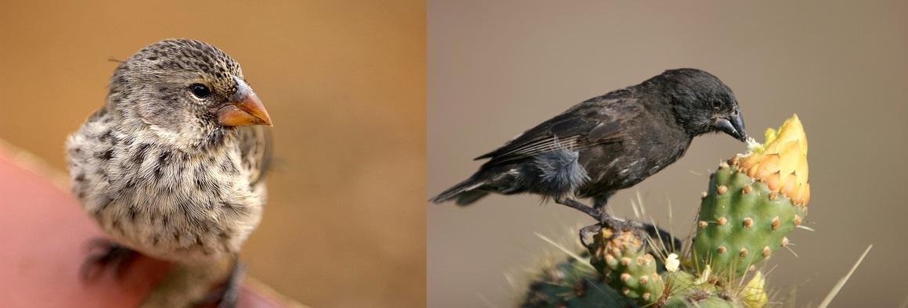

```{r setup, include=FALSE}
knitr::opts_chunk$set(echo = TRUE)
library(tidyverse)
library(stats)
library(infer)
library(groupedstats)
library(ggplot2)
library(dplyr)
library(car)
library(pander)
library(agricolae)
library(DescTools)
library(pgirmess)
library(multcomp)

### p.value.string v2
# Update v2: added the formatting that turns of scientific notation
# fixes the case when p = 0.0001 (instead of p=1e-4)
# This function called p.value.string creates a string
# to be used when reporting the p-value. It includes the p on the LHS.
# You will likely place it in $$ to get the LaTeX math formatting.
# This should be placed in an r code chunk in the beginning of your R markdown
# This code chunk by itself shouldn't produce any result.
# by Reid Ginoza

p.value.string = function(p.value){
  p.value <- round(p.value, digits=4)
  if (p.value == 0) {
    return("p < 0.0001")
  } else {
    return(paste0("p = ", format(p.value, scientific = F)))
  }
}


# function to create assumption assessment plots
# written by Reid Ginoza Fall 2019
# this pulls together the ANOVA assessment plots into a single image
almost_sas <- function(aov.results){
  par(mfrow=c(2,2))
  plot(aov.results, which=1)
  plot(aov.results, which=2)
  aov_residuals <- residuals(aov.results)
  plot(density(aov_residuals))
  hist(aov_residuals)
}
```

```{r data}
data1975 <- read_csv("finch_beaks_1975.csv")

data2012 <- read_csv("finch_beaks_2012.csv")

beak_depth <- c(data1975$bdepth, data2012$bdepth)

year_group <- as.factor(c(rep(1975, 403), rep(2012, 248)))

species_group <- as.factor(c(rep("Fortis", 316), rep("Scandens", 87), rep("Fortis", 121), rep("Scandens", 127)))

treatment_group <- as.factor(c(rep("Fortis-1975", 316), rep("Scandens-1975", 87), rep("Fortis-2012", 121), rep("Scandens-2012", 127)))

treamtent_groups_tibble <- tibble(treatment_group, beak_depth)
```

## Introduction

&emsp;&emsp; In the early 19th century Charles Darwin studied finches in the Galapagos Islands. His observations of the diverse finches, of which each species seemed to be specially adapted to its environment, likely contributed to his ideas about natural selection and evolution. Darwin's theory of evolution is now widely accepted, however further study and exploration continues. Darwin's finches remain an especially important subject of study, particularly their beak size and shape, which adapt quickly to environmental changes (Grant 2017).

&emsp;&emsp; The data set to be explored in this paper contains beak measurements taken by Peter and Rosemary Grant in 1975 and 2012 of two species of finches: Geospiza fortis, also known as the medium ground finch, and Geospiza scandens, or the common cactus finch. The data includes columns for beak length measurements and beak depth measurements for each species, however, for simplicity I will focus only on beak depth for the outcome variable of this paper.

&emsp;&emsp; Birds of both G. fortis and G. scandens species have an average lifespan of about 5-7 years, although some have been recorded to live at least 12 years in the wild (Gibbs and Grant, 1987, p. 803-804). Since this data is collected 37 years apart, the observations can safely be considered independent. The variables of interest are as follows:

**Outcome Variable**

- Beak depth: The distance, in millimeters, between the top and bottom of the beak.

**Predictor Variables**

- Year:
  - 1975 Group
  - 2012 Group

- Species: 
  - G. fortis
  - G. scandens
  


I will use one-way and two-way ANOVA to analyze the data and to find out which variables affect beak depth, and what interactions, if any, exist.


## Summary Statistics

### Summary Data for Each Treatment Group

```{r summary_stats}
summary_stats <- treamtent_groups_tibble %>%
                    group_by('Treament Group'=treatment_group) %>%
                    summarise(mean = mean(beak_depth), sd = sd(beak_depth), min=min(beak_depth), median = median(beak_depth), max = max(beak_depth), n = n()) 

summary_stats
```


 - The mean (standard deviation) beak depth for the G. fortis-1975 sample is `r round(summary_stats$mean[1], digits = 2)` (`r round(summary_stats$sd[1], digits = 2)`)mm. The median beak depth for the G. fortis-1975 sample is `r round(summary_stats$median[1], digits = 2)`mm.

 - The mean (standard deviation) beak depth for the G. fortis-2012 sample is `r round(summary_stats$mean[2], digits = 2)` (`r round(summary_stats$sd[2], digits = 2)`)mm. The median beak depth for the G. fortis-2012 sample is `r round(summary_stats$median[2], digits = 2)`mm.

 - The mean (standard deviation) beak depth for the G. scandens-1975 sample is `r round(summary_stats$mean[3], digits = 2)` (`r round(summary_stats$sd[3], digits = 2)`)mm. The median beak depth for the G. scandens-1975 sample is `r round(summary_stats$median[3], digits = 2)`mm.

 - The mean (standard deviation) beak depth for the G. scandens-2012 sample is `r round(summary_stats$mean[4], digits = 2)` (`r round(summary_stats$sd[4], digits = 2)`)mm. The median beak depth for the G. scandens-2012 sample is `r round(summary_stats$median[4], digits = 2)`mm.


### Treatment Groups Boxplots

```{r summary_boxplot}
treamtent_groups_tibble %>% 
  ggplot() +
    geom_boxplot(aes(factor(treatment_group), beak_depth, group = treatment_group)) + 
    xlab("Treatment Group") + 
    ylab("Beak depth (mm)") +
    theme_bw() 
```

### Treatment Groups Histograms

```{r bdepths_histogram}
ggplot(data = treamtent_groups_tibble, mapping = aes(x = beak_depth)) +
  geom_histogram(binwidth = 0.175, color = "black", fill = "lightgray") +
  facet_wrap(~ treatment_group, nrow = 2) +
  xlab("Beak depth (mm)") +
  theme_bw() 
```


## One-Way ANOVA: Year Group Variable

```{r one_way_ANOVA_1}
year_tibble <- tibble(beak_depth, year_group)
year_tibble_results <- aov(beak_depth ~ year_group, data = year_tibble)
year_tibble_table <- summary(aov(beak_depth ~ year_group, data = year_tibble))

pander(year_tibble_table, style='rmarkdown') 
```

### Hypothesis Test

**Hypotheses**

&emsp;&emsp; $H_0: \ \mu_\mbox{1975} = \mu_\mbox{2012}$ <br> 
&emsp;&emsp; $H_1:$ at least one is different

**Test Statistic**

&emsp;&emsp; $F_0 = `r round(year_tibble_table[[1]][["F value"]][1], digits=3)`$.

***p*-value**

&emsp;&emsp; $`r p.value.string(year_tibble_table[[1]][["Pr(>F)"]][1])`$.

**Rejection Region**

&emsp;&emsp; Reject if $p < \alpha$, where $\alpha=0.05$.

**Conclusion and Interpretation**

&emsp;&emsp; Reject $H_0$. There is sufficient evidence to suggest that beak depth is different in 1975 and 2012.


### Posthoc Test: Tukey's W

```{r tukey_anova_1}
year_tukey <- summary(glht(year_tibble_results, linfct = mcp(year_group = "Tukey")))

#year_tukey
```

|    Comparison     |  p-value  | Significant? |
|-------------------|-----------|--------------|
|  1975 vs. 2012    |  0.000159 |     Yes      |

Tukey's W posthoc test supports significance for the 1975 group compared with the 2012 group.

## One-Way ANOVA: Species Group Variable

```{r one_way_ANOVA_2}
species_tibble <- tibble(beak_depth, species_group)
species_tibble_results <- aov(beak_depth ~ species_group, data = species_tibble)
species_tibble_table <- summary(aov(beak_depth ~ species_group, data = species_tibble))

pander(species_tibble_table, style='rmarkdown') 
```

### Hypothesis Test


**Hypotheses**

&emsp;&emsp; $H_0: \ \mu_f = \mu_s$ <br> 
&emsp;&emsp; $H_1:$ at least one is different

**Test Statistic**

&emsp;&emsp; $F_0 = `r round(species_tibble_table[[1]][["F value"]][1], digits=3)`$.

***p*-value**

&emsp;&emsp; $`r p.value.string(species_tibble_table[[1]][["Pr(>F)"]][1])`$.

**Rejection Region**

&emsp;&emsp; Reject if $p < \alpha$, where $\alpha=0.05$.

**Conclusion and Interpretation**

&emsp;&emsp; Fail to reject $H_0$. There is not sufficient evidence to suggest that beak depth is different for the G. fortis and G. scandens species.


## Two-Way ANOVA

```{r two_way_ANOVA}

two_way_tibble <- tibble(species_group, year_group, beak_depth)

two_way_tibble_results <- aov(beak_depth ~ species_group*year_group, data = two_way_tibble)
two_way_tibble_table <- summary(two_way_tibble_results)

pander(two_way_tibble_table, style='rmarkdown') 
```

### Hypothesis test for interaction

**Hypotheses**

&emsp;&emsp; $H_0:$ There is not an interaction between species and year <br> 
&emsp;&emsp; $H_1:$ There is an interaction between species and year

**Test Statistic**

&emsp;&emsp; $F_0 = `r round(two_way_tibble_table[[1]][["F value"]][3], digits=2)`$.

***p*-value**

&emsp;&emsp; $`r p.value.string(two_way_tibble_table[[1]][["Pr(>F)"]][3])`$.

**Rejection Region**

&emsp;&emsp; Reject if $p < \alpha$, where $\alpha=0.05$.

**Conclusion and Interpretation**

&emsp;&emsp; Reject $H_0$. There is sufficient evidence to suggest that there is an interaction between species and year.


### Interaction plot

```{r profile_plot}
interaction.plot(x.factor     = two_way_tibble$year_group,
                 trace.factor = two_way_tibble$species_group,
                 response     = two_way_tibble$beak_depth,
                 fun = mean,
                 type="b",
                 col=c("blue", "green"),
                 pch=c(19, 17),
                 fixed=TRUE,
                 xlab = "Year Group",
                 ylab = "Beak Depth (mm)",
                 trace.label = "Species",
                 leg.bty = "o")
```

&emsp;&emsp; The lines intersect, clearly showing an interaction between species and year group.

### Graphical assessment

```{r graphs_2way_anova} 
almost_sas(two_way_tibble_results)
```

&emsp;&emsp; The variances seem to be approximately equal (top left graph), satisfying the equal variance assumption. In the top right, the Q-Q plot shows that the data follows an approximate 45 degree line, satisfying the normality assumption. The histogram, in the bottom right corner, has a roughly normal shape centered at 0. The bottom left graph shows that density also has a normal shape.

## Conclusion

&emsp;&emsp; The two-way ANOVA hypothesis test for interaction suggests an interaction between species and year group with p-value $`r p.value.string(two_way_tibble_table[[1]][["Pr(>F)"]][3])`$. This suggests that the combination of species type and the year of sampling has an affect on beak depth. This may be due to the two species adapting differently to environmental changes over time. This interaction is illustrated by the crossed lines of the profile plot. The ANOVA assumptions of normality and homogeneity of variance are both satisfied, so it seems that ANOVA was appropriate to use with this data.

## References

Grant, P. R. (2017), *Ecology and Evolution of Darwin's Finches*, Princeton, NJ: Princeton University Press

Grant, Peter R.; Grant, B. Rosemary (2013), Data from: 40 years of evolution. Darwin's finches on Daphne Major Island, Dryad, Dataset, https://doi.org/10.5061/dryad.g6g3h

Gibbs, H. Lisle, and Peter R. Grant. “Adult Survivorship in Darwin's Ground Finch (Geospiza) Populations in a Variable Environment.” Journal of Animal Ecology, vol. 56, no. 3, 1987, pp. 797–813. JSTOR, www.jstor.org/stable/4949. Accessed 16 Nov. 2020.